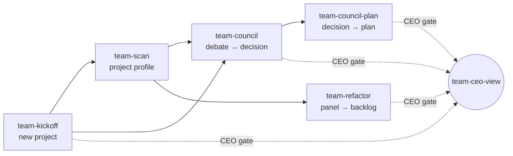

# team-skills

**Agent-team skills for [Claude Code](https://claude.com/claude-code).** Instead of one model giving one opinion, these skills dispatch a *team* of agents, each in its own isolated context. The agents debate with evidence, a gate kills speculative work, and **you, the CEO, make the final call** on a local HTML decision page.


## The skills

| Skill | What it does |
|-------|--------------|
| [`team-scan`](skills/team-scan/SKILL.md) | Detects a project's stack, conventions and available skills/agents, and writes `.council/project-profile.md`. Every other skill reads that profile. |
| [`team-council`](skills/team-council/SKILL.md) | A council of **PO, CTO, UX, Philosopher and Wildcard** (plus ad-hoc specialists), each anchored in a canon (Cagan, Brooks, Norman, Popper, Klein…), debates a decision. The roster and the number of rounds fit the decision: UX sits only when a user sees the change, and a reversible call gets one round. A PO synthesis then lays out consensus, tensions and a recommendation, and the decision is recorded. |
| [`team-council-plan`](skills/team-council-plan/SKILL.md) | Turns a recorded council decision into an implementation plan, which the CTO and PO roles vet before you approve it. |
| [`team-kickoff`](skills/team-kickoff/SKILL.md) | Bootstraps a brand-new project: vision → scan → council → project brief → initial profile and `CLAUDE.md`. |
| [`team-refactor`](skills/team-refactor/SKILL.md) | A panel of refactoring masters reviews scoped code blind: **Uncle Bob, Fowler, Beck, Feathers, Ousterhout**, and a **Minimalist** KISS/YAGNI gate that kills speculative abstractions. You approve the backlog, then it runs one behavior-preserving step per commit behind a characterization-test safety net. |
| [`team-ceo-view`](skills/team-ceo-view/SKILL.md) | Renders any gate above as a self-contained HTML page. An *Outcome* block shows where the work lands (a mockup of the target screen, a diagram of the target system) beside today's state. Each decision is a card that carries its own arguments, metrics, code diff and figures. You decide with the mouse or keyboard, then click **Send to Claude**: a one-shot local server hands your decisions straight back to the session. |
| [`team-protocol`](skills/team-protocol/SKILL.md) | The rules the others share: agent dispatch and contract, the run folder, how positions are counted, and the fresh-session handoff. You don't invoke it; the other skills load it. |

## How they fit together



Everything a run produces is plain Markdown under `.council/` in your project, so it can be committed and diffed:

```
.council/
├── project-profile.md          # team-scan
├── decisions/YYYY-MM-DD-*.md   # team-council, team-kickoff
├── refactors/YYYY-MM-DD-*.md   # team-refactor: the record
│   └── *.exec.md               # the executor's brief, deleted after execution
├── runs/<run>/                 # agent outputs during a run, deleted at its gate
├── gates/*.ceo.json → *.html   # team-ceo-view (regenerable), + *.decisions.txt
└── role-overrides/role-*.md    # optional: override any role per project
```

## Design principles

- **Separation of context.** Each role runs as its own agent and sees only what it needs. One context playing six roles gives you one opinion wearing six costumes.
- **Evidence, attributed, counted.** Every claim cites code, docs or a specialist skill, and is credited to the role that made it. The roles share one model, so a head count alone measures a shared prior: only a position with checkable evidence counts toward a majority.
- **Tensions are surfaced, not smoothed.** Disagreement is the useful output. Uncle Bob's small functions vs Ousterhout's deep modules is a choice for you to make, and the skill won't average it away. Each question is decided in one place: a majority goes in the backlog with the dissent on its card, and a tension is only a conflict with no majority.
- **The human decides.** Agents recommend; the CEO gate is where decisions happen, and Markdown stays the source of truth.
- **KISS/YAGNI has teeth.** In `team-refactor`, an abstraction needs a second use case that exists today. Roadmap talk doesn't count. The Minimalist's KILL is a gate, not a vote: only a card two panelists found independently goes to you as a tension.
- **Token economy.** Every agent turn re-reads its whole context, so the cost is context size × turns. Panelists run on Sonnet with a tool budget and write to files instead of pasting into the orchestrator. The council seats only the roles a decision needs. Each gate hands off to a fresh session through a file: the refactor executor reads a short exec brief, not the whole record. Small steps are batched per executor (still one commit each).

## Install

### As a Claude Code plugin

```
/plugin marketplace add TokiDEV/team-skills
/plugin install team-skills@team-skills
```

### Manually

```bash
git clone https://github.com/TokiDEV/team-skills.git
cp -r team-skills/skills/team-* ~/.claude/skills/
# or symlink them, so a git pull updates them:
for d in team-skills/skills/team-*; do ln -s "$PWD/$d" ~/.claude/skills/; done
```

Use one method or the other, not both, or every skill will show up twice.

**Requirements:** Claude Code with subagent support. `team-ceo-view` needs Node.js to render and serve its page. `team-scan` maps whatever skills, agents and MCP servers you have to the roles, so the council works without companions, and uses them when they're installed: for example [superpowers](https://github.com/obra/superpowers) (TDD, planning, plan execution) and [impeccable](https://impeccable.style) (UX audits).

## Usage

Ask in plain language; the skills trigger on intent:

> *"Scan this project for the council."*
> *"Run the council: should we move from REST to tRPC?"*
> *"Plan the council's decision."*
> *"Refactor src/billing — it's a god function nobody wants to touch."*

Or invoke one directly: `/team-refactor src/billing/invoice.js` after a manual install, or `/team-skills:team-refactor …` after a plugin install.

## Try the CEO view

[`examples/refactor-gate/`](examples/refactor-gate) holds a sample gate JSON and the page rendered from it. Download `invoice.html` and open it in a browser, or re-render it:

```bash
node skills/team-ceo-view/render.js examples/refactor-gate/invoice.ceo.json
# or serve it, as the skills do: Send to Claude prints the decisions and exits
node skills/team-ceo-view/render.js examples/refactor-gate/invoice.ceo.json --serve
```

Keyboard: `←`/`→` move between cards, `Tab` cycles the options, `Enter` chooses, `u` jumps to the next undecided card, and `?` lists every shortcut.

## Status

These are personal skills, shared as-is. Here is what has been exercised so far:

- ✅ `team-refactor` up to and including the CEO gate (compared against a no-skill baseline on a billing fixture)
- ✅ `team-refactor` end to end on a real TypeScript/Vue project: a PR-scoped review (Step 0 pins proven to bite, then each step committed, final review passed) and a repo-wide review (Step 0 plus about 20 steps, final review passed)
- ✅ `team-council` on a real architecture decision, recorded and later consumed by a refactor
- ✅ `team-scan` refreshing an existing profile
- ✅ `team-ceo-view` rendering and the decision round-trip, including large pages built by an agent on its own (up to 51 decisions, 3 tensions, 17 rejected items)
- ⚠️ The token-economy changes (model tiers, agent contract, fresh-session handoffs, Step Batches) have been checked by an agent reading them, not yet on a live run. They came from a weekend of live runs where most of the tokens went to the orchestrator's growing context and to executing long backlogs, not to the debate itself.
- ⚠️ Not yet on a live run either: the council's proportional roster and canon-anchored roles, evidence-based counting, the Minimalist gate rule, the refactor exec brief, and `team-protocol`. `render.js --serve` has been tested end to end in a headless browser.

Issues and PRs are welcome.

## License

[MIT](LICENSE)
