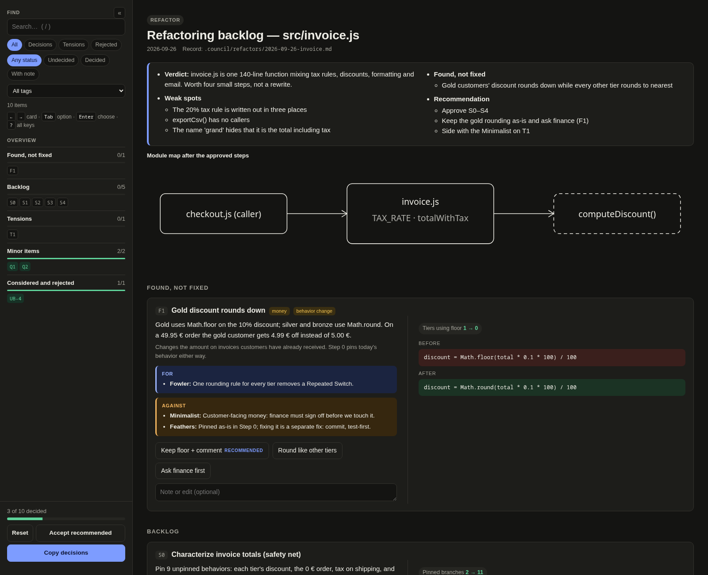
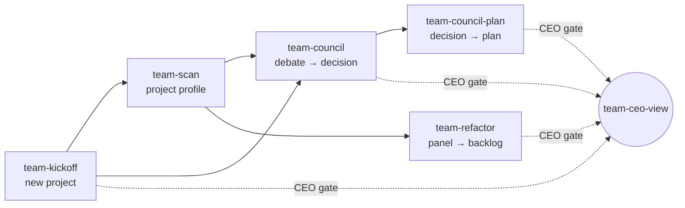

# team-skills

**Agent-team skills for [Claude Code](https://claude.com/claude-code).** Instead of one model giving one opinion, these skills dispatch a *team* of agents, each in its own isolated context. The agents debate with evidence, a gate kills speculative work, and **you, the CEO, make the final call** on a local HTML decision page.



## The skills

| Skill | What it does |
|-------|--------------|
| [`team-scan`](skills/team-scan/SKILL.md) | Detects a project's stack, conventions and available skills/agents, and writes `.council/project-profile.md`. Every other skill reads that profile. |
| [`team-council`](skills/team-council/SKILL.md) | A council of **PO, CTO, UX, Philosopher and Wildcard** (plus ad-hoc specialists) debates a decision in two rounds. A PO synthesis then lays out consensus, tensions and a recommendation, and the decision is recorded. |
| [`team-council-plan`](skills/team-council-plan/SKILL.md) | Turns a recorded council decision into an implementation plan, which the CTO and PO roles vet before you approve it. |
| [`team-kickoff`](skills/team-kickoff/SKILL.md) | Bootstraps a brand-new project: vision → scan → council → project brief → initial profile and `CLAUDE.md`. |
| [`team-refactor`](skills/team-refactor/SKILL.md) | A panel of refactoring masters reviews scoped code blind: **Uncle Bob, Fowler, Beck, Feathers, Ousterhout**, and a **Minimalist** KISS/YAGNI gate that kills speculative abstractions. You approve the backlog, then it runs one behavior-preserving step per commit behind a characterization-test safety net. |
| [`team-ceo-view`](skills/team-ceo-view/SKILL.md) | Renders any gate above as a self-contained HTML page. Each decision is a card that carries its own arguments, metrics, code diff and figures. You decide with the mouse or keyboard, then paste the decisions back into Claude. |

## How they fit together



Everything a run produces is plain Markdown under `.council/` in your project, so it can be committed and diffed:

```
.council/
├── project-profile.md          # team-scan
├── decisions/YYYY-MM-DD-*.md   # team-council, team-kickoff
├── refactors/YYYY-MM-DD-*.md   # team-refactor
├── gates/*.ceo.json → *.html   # team-ceo-view (regenerable)
└── role-overrides/role-*.md    # optional: override any role per project
```

## Design principles

- **Separation of context.** Each role runs as its own agent and sees only what it needs. One context playing six roles gives you one opinion wearing six costumes.
- **Evidence, attributed.** Every claim cites code, docs or a specialist skill, and is credited to the role that made it.
- **Tensions are surfaced, not smoothed.** Disagreement is the useful output. Uncle Bob's small functions vs Ousterhout's deep modules is a choice for you to make, and the skill won't average it away.
- **The human decides.** Agents recommend; the CEO gate is where decisions happen, and Markdown stays the source of truth.
- **KISS/YAGNI has teeth.** In `team-refactor`, an abstraction needs a second use case that exists today. Roadmap talk doesn't count.

## Install

### As a Claude Code plugin

```
/plugin marketplace add TokiDEV/team-skills
/plugin install team-skills@team-skills
```

### Manually

```bash
git clone https://github.com/TokiDEV/team-skills.git
cp -r team-skills/skills/team-* ~/.claude/skills/
# or symlink them, so a git pull updates them:
for d in team-skills/skills/team-*; do ln -s "$PWD/$d" ~/.claude/skills/; done
```

Use one method or the other, not both, or every skill will show up twice.

**Requirements:** Claude Code with subagent support. `team-ceo-view` needs Node.js to render its page. The other skills work without the optional companions, but use them when they're installed: [superpowers](https://github.com/obra/superpowers) (TDD, writing-plans) and [impeccable](https://impeccable.style) (UX audits).

## Usage

Ask in plain language; the skills trigger on intent:

> *"Scan this project for the council."*
> *"Run the council: should we move from REST to tRPC?"*
> *"Plan the council's decision."*
> *"Refactor src/billing — it's a god function nobody wants to touch."*

Or invoke one directly: `/team-refactor src/billing/invoice.js` after a manual install, or `/team-skills:team-refactor …` after a plugin install.

## Try the CEO view

[`examples/refactor-gate/`](examples/refactor-gate) holds a sample gate JSON and the page rendered from it. Download `invoice.html` and open it in a browser, or re-render it:

```bash
node skills/team-ceo-view/render.js examples/refactor-gate/invoice.ceo.json
```

Keyboard: `←`/`→` move between cards, `Tab` cycles the options, `Enter` chooses, `u` jumps to the next undecided card, and `?` lists every shortcut.

## Status

These are personal skills, shared as-is. Here is what has been exercised so far:

- ✅ `team-refactor` up to and including the CEO gate (compared against a no-skill baseline on a billing fixture)
- ✅ `team-ceo-view` rendering and the decision round-trip, including a gate built by a fresh agent
- ⚠️ `team-refactor`'s execution phase (step 6) has not been run end-to-end yet
- ⚠️ An agent filling in a *large* CEO page on its own has not been tested yet

Issues and PRs are welcome.

## License

[MIT](LICENSE)
